# DigiPOSE Station - Enterprise B2B Retail & POS Management Platform
**Official Architecture Overview & Feature Specification Manual (v1.0.0)**

DigiPOSE Station is a robust, high-performance Point of Sale (POS), Enterprise Resource Planning (ERP), and Online E-Commerce platform engineered for scalable retail operations and B2B cloud SaaS distribution. The platform integrates real-time in-store transaction terminal capabilities with an API-driven online storefront and an administrative CMS backoffice.

---

## 🖥️ Project Visuals & Architecture Showroom

### 1. Security & Identity Gateway

<p align="center">
  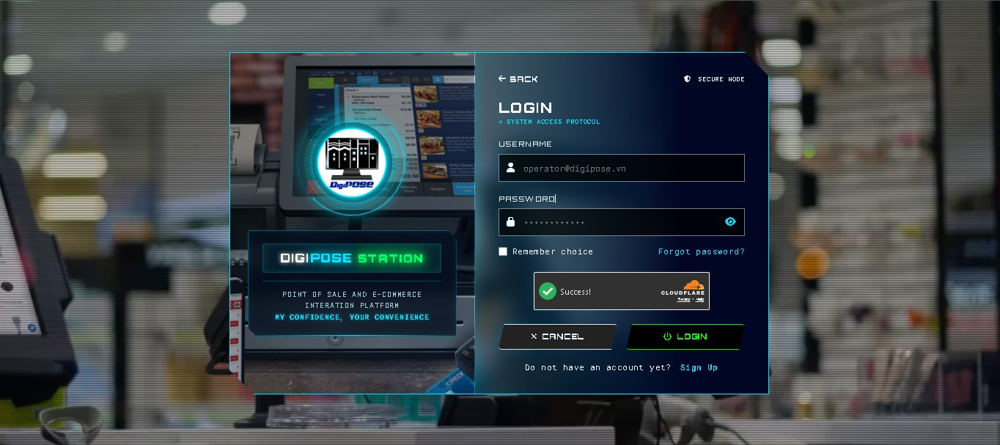
  <br />
  <strong>System Login & Resilient Bot Defense Gateway</strong><br />
  <em>Featuring a cyber-cinematic dark glassmorphism canvas, high-density typography brand cards, and integrated Cloudflare Turnstile bot protection with resilient backend Exponential Backoff verification.</em>
</p>

<p align="center">
  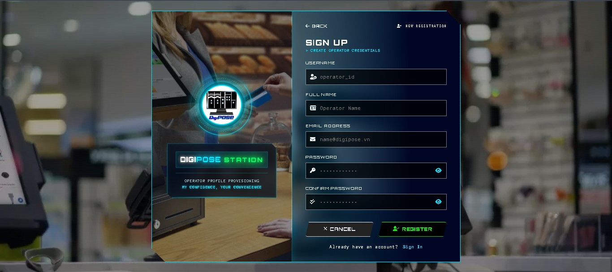
  <br />
  <strong>Enterprise User Registration & Identity Enrollment</strong><br />
  <em>Seamless operator onboarding workflow equipped with strict real-time input validation, interactive visual feedback, and automated automated threat interception.</em>
</p>

---

### 2. E-Commerce & Retail Storefront

<p align="center">
  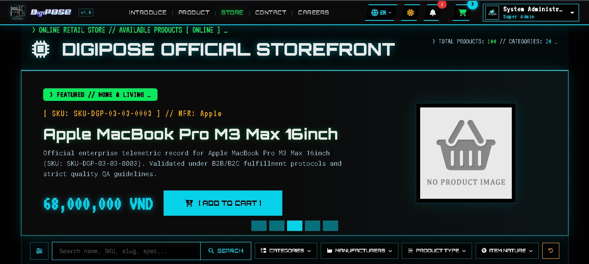
  <br />
  <strong>Dynamic B2B & Retail Commercial Portal</strong><br />
  <em>Low-latency e-commerce storefront presenting reactive product showcases, real-time availability badges, promotional displays, and optimized server-side rendering (SSR) for enterprise SEO.</em>
</p>

<p align="center">
  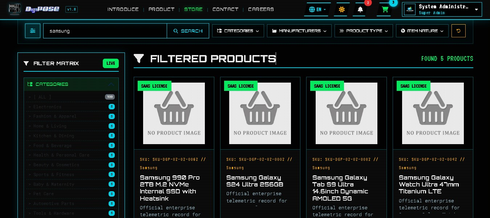
  <br />
  <strong>Multi-Tier Search & Filtering Engine</strong><br />
  <em>High-performance catalog drill-down system enabling instantaneous filtering across dynamic brand taxonomies, technical categories, price brackets, and full-text queries without page transitions.</em>
</p>

---

### 3. Enterprise CMS & Operations Hub

<p align="center">
  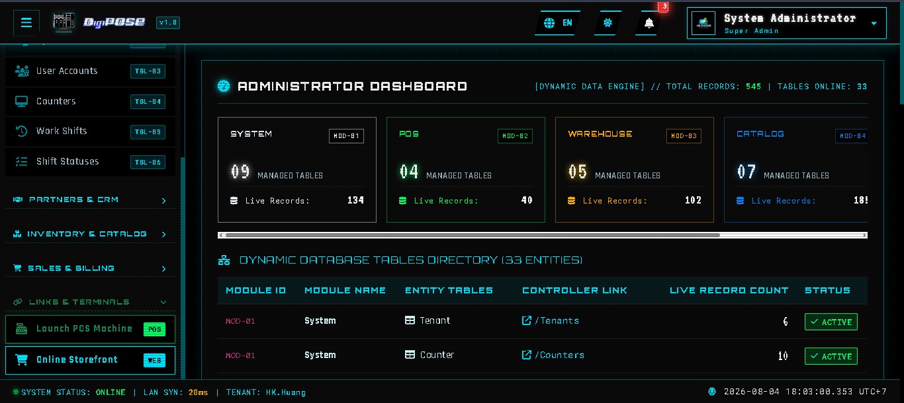
  <br />
  <strong>Administrator Command & Telemetry Dashboard</strong><br />
  <em>Central command hub for system governors, displaying real-time financial KPI metrics, active terminal shift monitoring, revenue charts, and high-density administrative routing grids.</em>
</p>

<p align="center">
  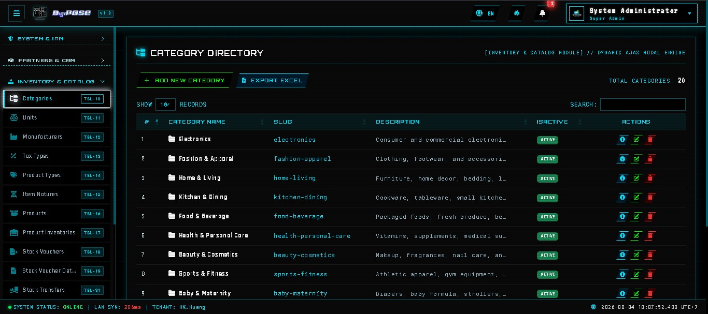
  <br />
  <strong>Master Data Catalog Control Sub-System</strong><br />
  <em>Comprehensive entity administration center managing dynamic SKU structures, barcode binding, measurement unit transformations, and multi-level product category classifications.</em>
</p>

<p align="center">
  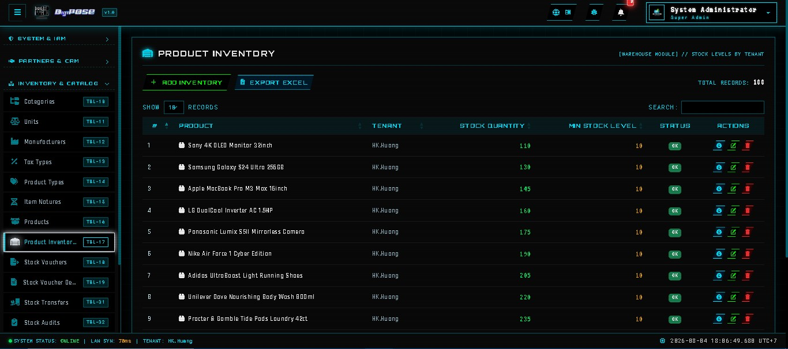
  <br />
  <strong>Real-Time RAM & Physical Inventory Governance</strong><br />
  <em>O(1) in-memory stock management ledger backed by atomic SQL database synchronization, automated stock restoration upon order voids, and real-time SignalR low-stock alerting.</em>
</p>

<p align="center">
  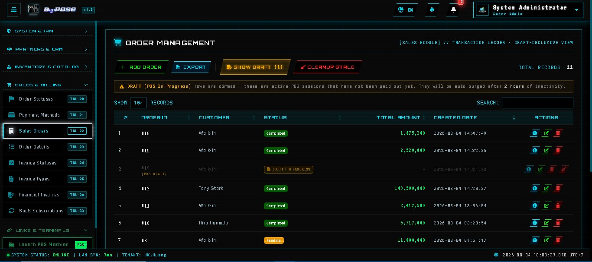
  <br />
  <strong>Sales & Financial Billing Operations Module</strong><br />
  <em>Real-time electronic invoice verification and transaction auditing, powered by an enterprise VAT Balancing Engine that guarantees 100% cent-precision accounting ledger alignment.</em>
</p>

<p align="center">
  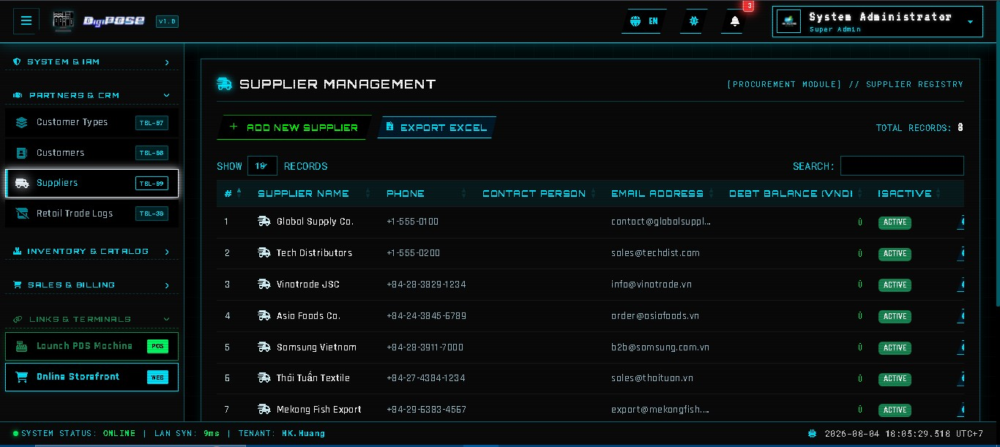
  <br />
  <strong>B2B Commercial Partners & CRM Directory</strong><br />
  <em>Enterprise relationship database managing VIP customer tiers, corporate tax compliance parameters (Tax Code MST & Company names), and upstream supply chain vendors.</em>
</p>

<p align="center">
  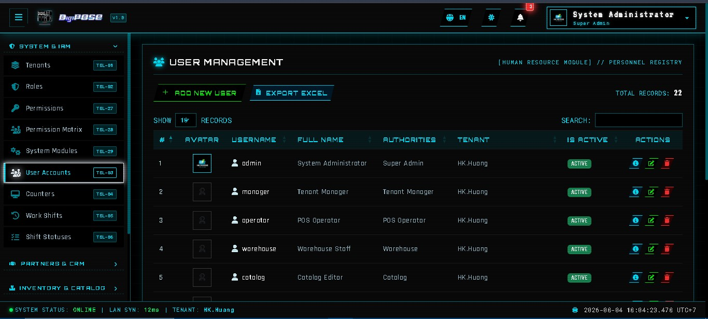
  <br />
  <strong>Zero-Trust IAM & RBAC Security Governance</strong><br />
  <em>Fine-grained Role-Based Access Control portal administering granular execution privileges, operator group memberships, and secure credential policies across all terminal tiers.</em>
</p>

---

### 4. Cyber-Cinematic Design System FX

<p align="center">
  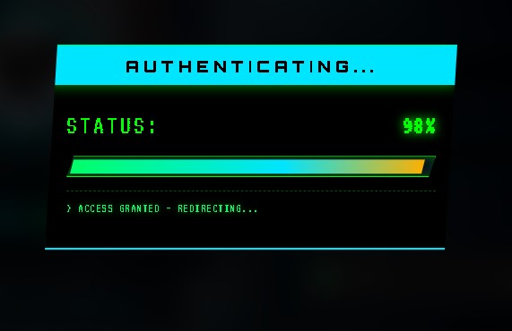
  <br />
  <strong>Exclusive Military HUD & Lab Telemetry FX</strong><br />
  <em>Bespoke segmented progress indicators, high-contrast scanline visual layers, and neon status indicators (#00E5FF, #00FF66, #FFB000, #FF3333) engineered for instantaneous operational scannability.</em>
</p>

---

## 🏛 1. System Architecture Overview

DigiPOSE adopts a decoupled domain-driven architecture separating public commerce interfaces from administrative core ledgers:

```
                  [ CLIENT WEB & POS TERMINALS ]
               (Next.js 15 / React 19 / TypeScript / Tailwind)
               ├── E-Commerce Storefront ---> http://localhost:3000/
               ├── POS Cashier Terminal  ---> http://localhost:3000/pos
               └── Shopping Cart Bridge  ---> http://localhost:3000/cart
                                 │
                   (RESTful JSON API / JWT Bearer)
                                 │
                                 ▼
               [ ASP.NET CORE MVC & API GATEWAY ]
                     (http://localhost:5128/)
         ┌───────────────────────┴───────────────────────┐
         ▼                                               ▼
[ ADMINISTRATOR CMS ]                         [ RESTful WEB API MODULES ]
 (ASP.NET Core Razor / Cookie Auth)           (Controllers/Api/ -> Stateless JSON)
 ├── Master Data Management (30 Controllers)  ├── POS Operations & Shifts (PosController)
 ├── Financial Analytics & SLA Reports        ├── Storefront Catalog & Checkout (Storefront)
 └── Role-Based Access Control (RBAC)         └── Real-Time SignalR WebSockets (PosRealtimeHub)
         │                                               │
         └───────────────────────┬───────────────────────┘
                                 │
                [ SERVICES & BACKGROUND WORKERS ]
                ├── IInventoryRAMService (O(1) Memory Manager)
                ├── IVatBalancingEngine (VAT Cent Rounding)
                ├── ICloudflareTurnstileService (Resilient Bot Defense)
                ├── InventoryWarmupWorker (RAM Pre-loader)
                └── ResilientInvoiceWorker (Async MailKit Queue)
                                 │
                   (Entity Framework Core 10)
                                 ▼
                  [ SQL SERVER DATABASE ENGINE ]
```

---

## ✨ 2. Implemented Features & Core Capabilities

### 🛒 A. High-Speed Cashier POS Terminal (`/POS` & `PosController.cs`)
* **O(1) In-Memory Stock Deduction**: Pre-deducts and validates product stock instantly via `IInventoryRAMService` (<15ms latency) before executing database transactions.
* **Hardware Debounce Guard**: Integrated `IMemoryCache` TTL buffer prevents accidental double-scanning from physical laser barcode scanners.
* **VAT Rounding & Balancing Engine (`VatBalancingEngine.cs`)**: Implements an enterprise VAT cent balancing algorithm (`Round(Sum(PreTax) * TaxRate, 2)` vs line-item rounding) that injects tax variance into the primary line item, guaranteeing 100% financial ledger match.
* **Dual-Layer Idempotency Safeguard**: RAM cache checks combined with SQL unique constraint locks eliminate duplicate transaction processing during unstable network connectivity.
* **Cashier Tender & Change Calculation**: Records `TenderedAmount` and automatically computes exact `ChangeAmount` for accurate cash drawer reconciliation.
* **Shift & Counter Management**: Open/close cashier shifts, balance cash drawers, and map terminal counters (`ShiftsController`, `CountersController`).

### 🌐 B. Online E-Commerce Storefront (`/`, `/cart` & `StorefrontController.cs`)
* **Dynamic Product Catalog**: Multi-layer filtering, pagination, full-text searching, category navigation, and SSR SEO metadata optimization.
* **Session Shopping Cart (`cartStore.ts`)**: Client-side Zustand state buffer supporting real-time stock availability verification.
* **Atomic Order Checkout**: Calculates delivery fees (`ShippingFee`), records recipient information (`ShippingAddress`), saves customer notes (`OrderNotes`), and wraps creation in isolated SQL transactions (`BeginTransactionAsync`).

### 📡 C. Real-Time Telemetry & SignalR Broadcasting (`PosRealtimeHub.cs`)
* **Instant Stock Synchronization**: Broadcasts inventory updates (`OnStockChanged`) across all active POS terminals within <1ms.
* **Low Stock Alerts**: Automatic alert dispatching (`LowStockAlerts <= 5`) to cashiers and store administrators.
* **Live Order Arrival**: Pushes real-time web order notifications (`WEB_ORDER_CREATED`) directly to administrative HUD monitors.

### 🛡️ D. Resilient Security & Bot Defense (`CloudflareTurnstileService.cs`)
* **Zero-Friction Turnstile Verification**: Fully integrated Cloudflare Turnstile CAPTCHA solution defending Login and Registration endpoints against automated threats.
* **Resilient Exponential Backoff**: Intelligent HTTP retry mechanism handling cloud communication failures gracefully without degrading user experience.
* **SecOps Credential Isolation**: Pre-commit guardrails isolating sensitive configurations into `.example` template schemas (`appsettings.example.json`) while shielding actual keys via strict `.gitignore` rules.

### ⚡ E. Asynchronous Background Engine (`Services/Background/`)
* **`InventoryWarmupWorker`**: Pre-loads active branch inventory levels into high-speed memory on ASP.NET Core startup.
* **`ResilientInvoiceWorker`**: Asynchronous background queue executing electronic invoice generation and MailKit SMTP email dispatching without blocking payment checkout threads.

### 🏢 F. Enterprise Backoffice CMS (`/Administrator` & `Areas/Administrator/`)
* **30 Master Data Controllers**: Complete administrative CRUD for 26 database entities (Products, Inventories, Categories, Suppliers, Customers, Manufacturers, Units, Tax Types, Payment Methods, etc.).
* **Inventory Restoration & Order Safeguard (`OrdersController.cs`)**: Cancelling or deleting orders automatically restores RAM stock (`RestoreStock`), logs audit vouchers (`InventoryTransactions`), and notifies POS terminals via SignalR.
* **RBAC & Security**: Fine-grained Role-Based Access Control (`Permissions`, `Roles`, `UserRoles`), BCrypt password hashing, and Cookie/JWT authentication.
* **Cyber-Cinematic HUD UI**: High-density military lab aesthetic featuring custom dark mode canvas (`#000000`), neon status indicators (`#00E5FF`, `#00FF66`, `#FFB000`, `#FF3333`), segmented progress bars, and scanline FX.

---

## 📁 3. Repository Structure

```
digipose/
├── backend/                  # Backend applications (.NET SDK 10.0)
│   └── DigiPOSE/             # ASP.NET Core MVC & RESTful Web API project
│       ├── Areas/            # Administrator Backoffice CMS MVC views and controllers (30 Controllers)
│       ├── Controllers/      # API REST Endpoints (Controllers/Api/ -> PosController, StorefrontController)
│       ├── Hubs/             # Real-Time WebSocket Hubs (PosRealtimeHub)
│       ├── Models/           # EF Core Entities, Database Context, and DTO Schemas
│       ├── Services/         # Business logic, RAM inventory manager, Turnstile verifier & VAT balancing engine
│       │   └── Background/   # Hosted services (InventoryWarmupWorker, ResilientInvoiceWorker)
│       ├── Views/            # Razor Server-Side Web & Cyber-HUD layout templates
│       └── wwwroot/          # Hosted stylesheet frameworks and uploaded product media
├── frontend/                 # Client web application (Node 20+)
│   ├── app/                  # Next.js 15 App Router pages (/, /pos, /cart)
│   ├── components/           # Reusable functional UI & Cyber-HUD components (CyberNavbar, CyberSidebar)
│   ├── services/             # API client network fetchers and Axios endpoints
│   ├── store/                # Zustand local client state management (cartStore, authStore)
│   └── types/                # Strict TypeScript interface declarations
├── docs/                     # System deployment architecture & functional domain specifications
├── assets/                   # System branding, architecture visual showcases, and static media assets
└── demo/                     # Screenshots and UI demo media isolation
```

---

## 💻 4. Technology Stack & Prerequisites

### Technology Stack
* **Backend Runtime**: .NET 10.0 SDK, ASP.NET Core MVC, ASP.NET Core Web API, SignalR.
* **Database & ORM**: Microsoft SQL Server 2022+, Entity Framework Core 10, System.Linq.Dynamic.Core.
* **Frontend Runtime**: Node.js v20+, Next.js 15, React 19, TypeScript, Tailwind CSS v4, PostCSS.
* **State & Network**: Zustand, TanStack React Query, Axios.
* **Security & Utility**: Cloudflare Turnstile, BCrypt.Net-Next (Hash Encryption), MailKit (SMTP Electronic Receipt Delivery), Stateless JWT Bearer & Secure HTTP-Only Cookie Authentication.

### Prerequisites & Required Tooling
* [.NET SDK 10.0+](https://dotnet.microsoft.com/download/dotnet/10.0)
* [Node.js (v20.x or higher) & npm](https://nodejs.org/)
* [Microsoft SQL Server (2019/2022) or SQL Server Developer/Express](https://www.microsoft.com/en-us/sql-server)
* [Git Version Control](https://git-scm.com/)

---

## 🚀 5. Build, Installation & Execution Guide

### Step 1: Clone Repository & Configure Database Connection
1. Clone the project repository:
   ```bash
   git clone <repository-url> digipose
   cd digipose
   ```
2. Open `backend/DigiPOSE/appsettings.json` (or copy from `appsettings.example.json`) and configure `DefaultConnection`:
   ```json
   "ConnectionStrings": {
     "DefaultConnection": "Server=localhost;Database=DigiPOSE_DB;Trusted_Connection=True;TrustServerCertificate=True;"
   },
   "CloudflareTurnstile": {
     "SiteKey": "1x00000000000000000000AA",
     "SecretKey": "1x0000000000000000000000000000000AA"
   }
   ```

### Step 2: Install Backend Packages & Apply Database Schema
1. Restore NuGet packages:
   ```powershell
   cd backend/DigiPOSE
   dotnet restore
   ```
2. Compile backend project:
   ```powershell
   dotnet build --nologo -v q
   ```
3. Update EF Core database schema and seed initial data:
   ```powershell
   dotnet ef database update
   ```

### Step 3: Start ASP.NET Core Backend & REST API Server
Launch the backend dev server:
```powershell
dotnet run
```
Default endpoint links:
* **Administrator Backoffice CMS**: `http://localhost:5128/Administrator`
* **In-Store POS Terminal**: `http://localhost:5128/POS`
* **POS REST API Gateway**: `http://localhost:5128/api/v1/pos/products`
* **Storefront REST API Gateway**: `http://localhost:5128/api/v1/Storefront/user-identity`

---

### Step 4: Install & Launch Frontend Next.js Web Client
Open a separate terminal window:
1. Navigate to frontend:
   ```powershell
   cd frontend
   ```
2. Install packages:
   ```powershell
   npm install
   ```
3. Launch development client:
   ```powershell
   npm run dev
   ```
Default client links:
* **Online E-Commerce Storefront**: `http://localhost:3000/`
* **In-Store Cashier POS Terminal**: `http://localhost:3000/pos`
* **Shopping Cart & Checkout**: `http://localhost:3000/cart`

---

## 🏗 6. Production Build & Deployment Guide

### Backend Release Publishing
```powershell
cd backend/DigiPOSE
dotnet publish -c Release -o ./publish
```

### Frontend Bundle Production Generation
```powershell
cd frontend
npm run build
npm run start --port 3000
```

---

## 🔐 7. Enterprise Security & Ledger Guardrails
* **Secret Isolation**: All credentials, Turnstile keys, JWT secrets, and SMTP tokens are shielded via `.gitignore` and configured through isolated environment variables or sanitized example templates.
* **IDOR Prevention**: API endpoints validate decoded JWT tokens and enforce tenant boundaries.
* **ACID Financial Transactions**: Payment checkouts use `BeginTransactionAsync` with explicit rollback handling to ensure zero data corruption.
