# DigiPOSE Station - Nền Tảng Quản Trị Hệ Thống POS & ERP Bán Lẻ Doanh Nghiệp
**Tài Liệu Kiến Trúc & Danh Mục Chức Năng Chuẩn Hóa Theo Thực Tế (v1.0.0)**

DigiPOSE Station là hệ thống quản trị điểm bán lẻ (POS), hoạch định tài nguyên doanh nghiệp (ERP) và thương mại điện tử (E-Commerce) hiện đại, hiệu năng cao, được thiết kế cho các chuỗi bán lẻ quy mô lớn và phân phối phần mềm đám mây B2B (SaaS). Nền tảng hợp nhất toàn bộ hoạt động bán hàng trực tiếp tại quầy, cổng đặt hàng trực tuyến và trung tâm điều hành quản trị CMS vào một kiến trúc ứng dụng máy chủ hợp nhất với độ trễ gần như bằng không.

---

## 🖥️ Trình Diễn Kiến Trúc & Giao Diện Thực Tế (Project Visuals)

### 1. Phân Hệ Lõi: Trạm Bán Hàng POS & Bảng Điều Khiển Telemetry
<details open>
<summary><strong>🛒 Nhấn để thu ngớt/bỏ mở Giao diện POS Terminal & Báo cáo Ban Quản trị (7 Mô-đun)</strong></summary>
<br/>

<p align="center">
  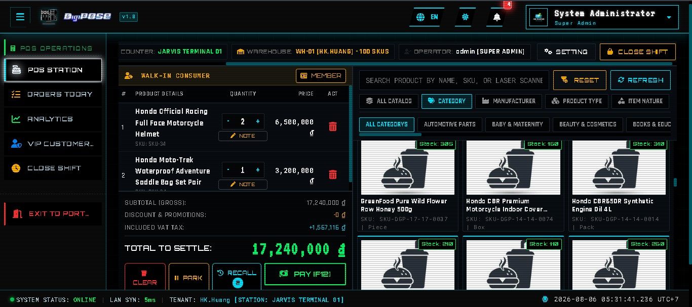
  <br />
  <strong>Giao Diện Lõi Trạm Thu Ngân POS (Main POS Terminal Station HUD)</strong><br />
  <em>Giao diện bán hàng trực tiếp phong cách Cyber-Cinematic có mật độ hiển thị cao, tích hợp công nghệ trừ kho O(1) trên RAM Cache, chống trôi đúp tín hiệu máy quét mã vạch và tính toán hóa đơn tức thì.</em>
</p>
<hr/>

<p align="center">
  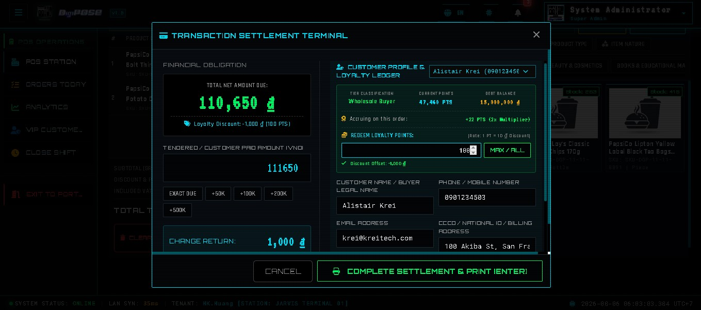
  <br />
  <strong>Cửa Sổ Thanh Toán & Động Cơ Khấu Trừ Điểm Tích Lũy VIP (Loyalty Point Offset Engine)</strong><br />
  <em>Cửa sổ chốt đơn tài chính áp đặt cơ chế cấm chi tiền mặt thấp hơn giá trị đơn hàng, tự động làm tròn và cân bằng thuế VAT đến từng đồng, hỗ trợ cấn trừ trực tiếp điểm tích lũy theo định giá 1 PT = 10 ₫.</em>
</p>
<hr/>

<p align="center">
  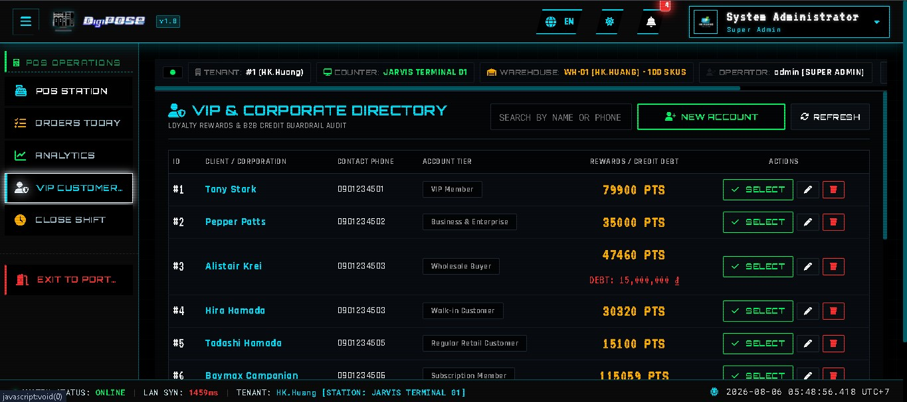
  <br />
  <strong>Danh Mục Đối Tác VIP & Báo Cáo Hạn Mức Tín Dụng Nợ (B2B Debt Limit Dashboard)</strong><br />
  <em>Theo dõi hạng thẻ khách hàng thời gian thực, hệ số nhân tích lũy điểm thưởng (2x đối với thẻ VIP) và ghi nhận biến động công nợ của các bên hợp tác.</em>
</p>
<hr/>

<p align="center">
  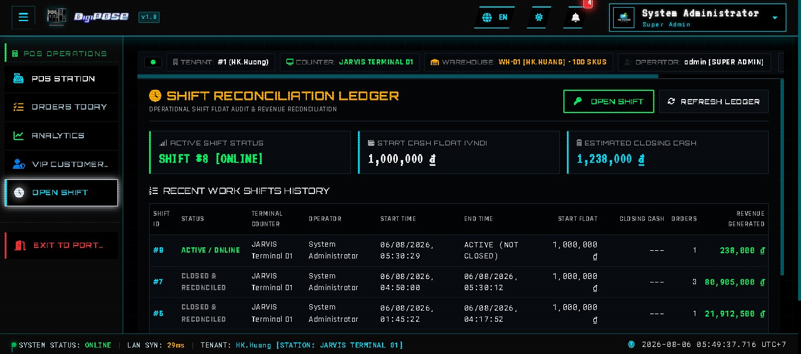
  <br />
  <strong>Quản Trị Ca Thu Ngân & Đối Soát Sổ Két Chi Bồi (Shift & Revenue Reconciliation)</strong><br />
  <em>Kiểm duyệt dòng tiền bàn giao đầu ca và cuối ca, ghi nhận sai lệnh số dư tiền mặt thực tế và đối chứng lịch sử truy vết giao dịch thu ngân.</em>
</p>
<hr/>

<p align="center">
  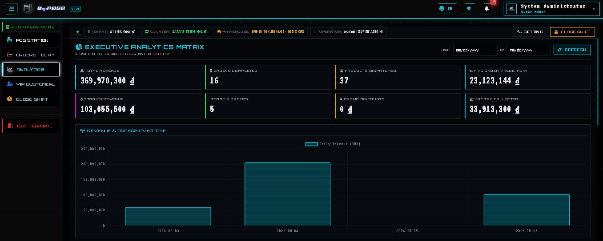
  <br />
  <strong>Lưới Đo Lường Ban Quản Trị - Biểu Đồ Doanh Thu & Lưu Lượng (Executive Analytics Grid #1)</strong><br />
  <em>Trung tâm chỉ huy trực quan phơi sáng chu kỳ doanh thu theo từng khung giờ bán, quy mô khối lượng giao dịch ròng và tốc độ chốt đơn của quầy hàng.</em>
</p>
<hr/>

<p align="center">
  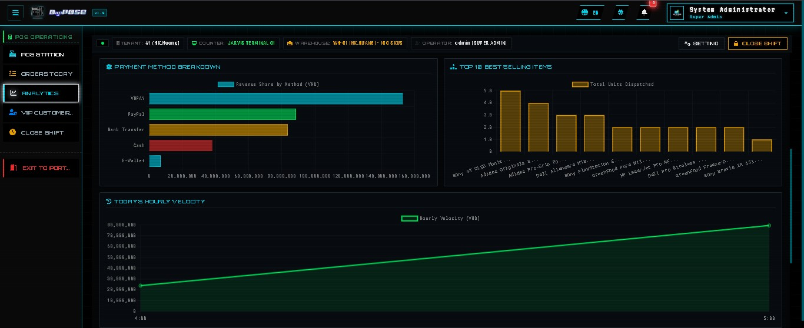
  <br />
  <strong>Lưới Đo Lường Ban Quản Trị - Danh Mục Tồn Kho & Lợi Nhuận (Executive Analytics Grid #2)</strong><br />
  <em>Thống kê chuyên sâu về vận tốc luân chuyển kho bãi, định diện các dòng hàng đem lại biên lợi nhuận cao và cảnh báo mức cận dưới tái xuất đơn bao thầu.</em>
</p>
<hr/>

<p align="center">
  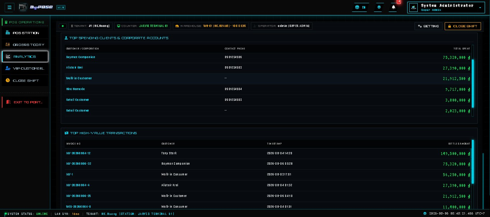
  <br />
  <strong>Lưới Đo Lường Ban Quản Trị - Đối Soát Kế Toán & SLA (Executive Analytics Grid #3)</strong><br />
  <em>Hồ sơ báo cáo kiểm duyệt tuân thủ biểu giá VAT pháp định, minh bạch nhật ký truy thoái hóa đơn và thông số ổn định thời gian phản hồi (SLA Telemetry) toàn chuỗi.</em>
</p>
</details>

---

### 2. Phân Hệ Lõi: Cổng Thương Mại Điện Tử & Hành Trình Khách Hàng
<details open>
<summary><strong>🛍️ Nhấn để thu ngớt/bỏ mở Cổng Thương Mại & Tra Cứu Khách Hàng (8 Mô-đun)</strong></summary>
<br/>

<p align="center">
  
  <br />
  <strong>Cổng Bán Lẻ & Đặt Hàng Thương Mại Điện Tử (Dynamic Storefront Portal)</strong><br />
  <em>Cổng thương mại trực tuyến độ trễ thấp, trình chiếu các bộ sưu tập động, hiển thị bảng gắn nhãn thực trạng hàng trong kho real-time và tối ưu Server-Side Rendering cho tiêu chuẩn SEO chuẩn doanh nghiệp.</em>
</p>
<hr/>

<p align="center">
  
  <br />
  <strong>Bộ Động Cơ Tìm Kiếm & Lọc Danh Mục Đa Tầng (Multi-Tier Expert Search Engine)</strong><br />
  <em>Hệ thống tra cứu thông tin sản phẩm đa tầng tốc độ siêu cao, lọc tức thì theo cây danh mục kỹ thuật, thương hiệu, mức giá và tra cứu toàn văn (Full-Text) bằng kỹ thuật AJAX không ngắt trang.</em>
</p>
<hr/>

<p align="center">
  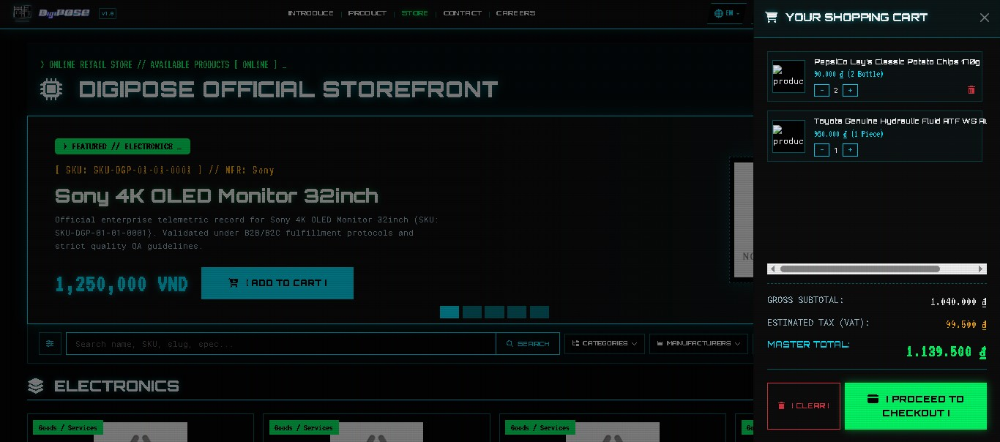
  <br />
  <strong>Động Cơ Quản Trị Giỏ Hàng & Kiểm Xác Tồn Kho (Reactive Shopping Cart Bridge)</strong><br />
  <em>Cầu nối quản lý sản phẩm lựa chọn mua sắm, kiểm chứng độ khả dụng số lượng mua trực tiếp với CSDL tồn kho thời gian thực và ước tính chi phí sơ bộ.</em>
</p>
<hr/>

<p align="center">
  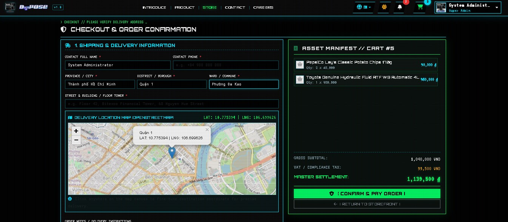
  <br />
  <strong>Cổng Đặt Hàng & Hệ Thống Định Danh Hành Chính GIS Việt Nam (Checkout & GIS Engine)</strong><br />
  <em>Quy trình thanh toán mạch lạc tích hợp cây lựa chọn Tỉnh/Thành - Quận/Huyện - Phường/Xã với hạ tầng lưu đệm đĩa cứng ngoại tuyến (Offline Disk Cache), tiếp nhận dữ liệu hóa đơn doanh nghiệp B2B (Mã số thuế & Tên Cty).</em>
</p>
<hr/>

<p align="center">
  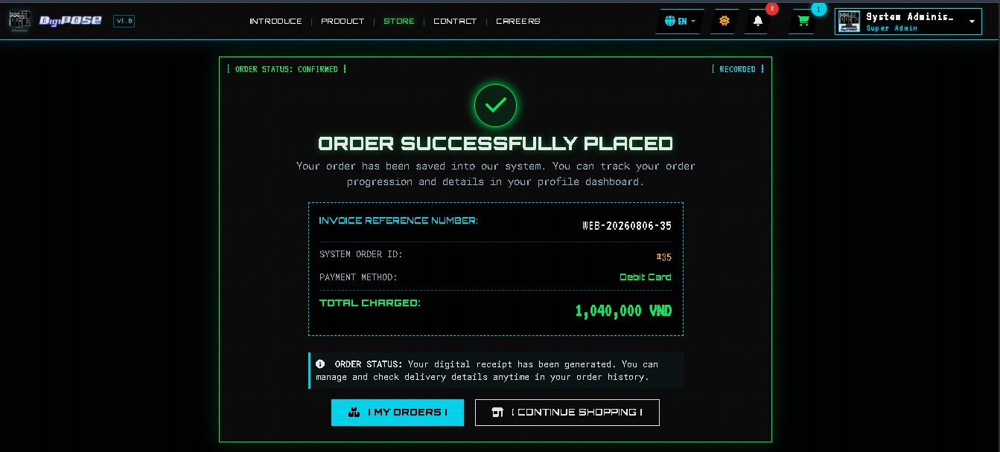
  <br />
  <strong>Chứng Nhận Giao Dịch & Khai Xuất Chứng Từ Thuế (Order Confirmation & Receipt Spooling)</strong><br />
  <em>Phản hồi xác lập đơn đặt hàng thành công mang mã hóa đơn định tính gốc, thỏa ước thời gian giao nhận cam kết và phiếu biên nhận đối kiểm pháp luật.</em>
</p>
<hr/>

<p align="center">
  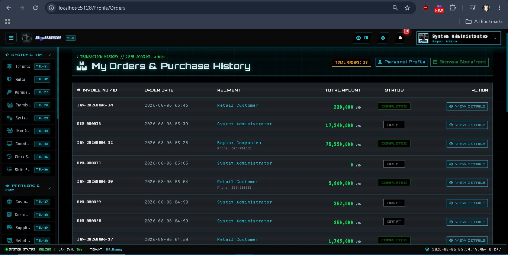
  <br />
  <strong>Cổng Giám Sát Tiến Trình Đơn Hàng & Sổ Trạng Thái ACID (Order Tracking Hub)</strong><br />
  <em>Bảng thông tin minh bạch cho phép người buôn tiêu theo dõi trọn vẹn quy trình xuất kho, vận tải cũng như cho phép tải lại chứng từ lịch sử kinh doanh.</em>
</p>
<hr/>

<p align="center">
  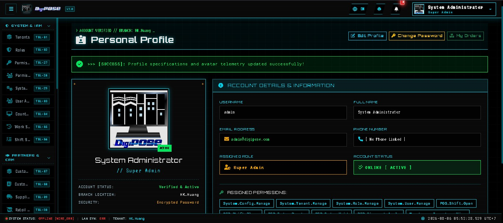
  <br />
  <strong>Hồ Sơ Danh Tính cá Nhân & Số Dư Kho Điểm Thưởng (Personal Profile & Loyalty Ledger)</strong><br />
  <em>Két định danh cá nhân quản trị danh tính tiêu dùng, thống kê chu kỳ tích lũy điểm thưởng thành viên, lưu trữ sổ địa chỉ giao hàng và thông số tùy biến bảo mật.</em>
</p>
<hr/>

<p align="center">
  
  <br />
  <strong>Ngôn Ngữ Thiết Kế Cyber-Cinematic & Thanh Tiến Trình Giao Dịch (Military HUD FX)</strong><br />
  <em>Thiết kế độc quyền với thanh tiến trình phân đoạn (Segmented Progress Bars), đường vạch tia quét hiển thị mật độ thông tin cao và bảng phối màu huỳnh quang (#00E5FF, #00FF66, #FFB000, #FF3333).</em>
</p>
</details>

---

### 3. Trung Tâm Quản Trị Hậu Đài & ERP (Enterprise CMS & Operations Hub)
<details>
<summary><strong>🏢 Nhấn để thu ngớt/bỏ mở Phân Hệ Quản Trị Trung Tâm CMS & ERP (6 Mô-đun)</strong></summary>
<br/>

<p align="center">
  
  <br />
  <strong>Bảng Điều Khiển Telemetry & Chỉ Số Doanh Nghiệp (Administrator Command Center)</strong><br />
  <em>Trung tâm chỉ huy dành cho Ban Quản trị, giám sát thời gian thực các chỉ số KPI doanh thu, trạng thái các ca bán hàng đang vận hành và lưới điều hướng nhanh đến toàn bộ phân hệ ERP.</em>
</p>
<hr/>

<p align="center">
  
  <br />
  <strong>Phân Hệ Quản Trị Dữ Liệu Gốc & Danh Mục Hàng Hóa (Master Data Catalog Manager)</strong><br />
  <em>Trung tâm thao tác CRUD toàn diện quản lý hơn 26 thực thể dữ liệu doanh nghiệp, cho phép gán cấu hình mã vạch (Barcode/SKU), quy đổi đơn vị tính và quy hoạch cây danh mục đa cấp.</em>
</p>
<hr/>

<p align="center">
  
  <br />
  <strong>Trung Tâm Quản Trị Tồn Kho Biến Động O(1) (Real-Time RAM Inventory Governance)</strong><br />
  <em>Hạ tầng theo dõi mức tồn kho được nạp siêu tốc trên RAM Cache, tự động khôi phục số lượng khi phát sinh lệnh hủy đơn và liên tục đối soát nhật ký kiểm kê bằng chứng từ cơ sở dữ liệu SQL.</em>
</p>
<hr/>

<p align="center">
  
  <br />
  <strong>Phân Hệ Quản Trị Hóa Đơn & Tài Chính Bán Hàng (Sales & Billing Manager)</strong><br />
  <em>Kênh kiểm tra và chứng thực hóa đơn điện tử thời gian thực, trang bị Thuật toán Cân bằng Thuế VAT (VAT Balancing Engine) bảo đảm tổng số tiền đối soát trên sổ sách kế toán trùng khớp tuyệt đối đến từng đồng.</em>
</p>
<hr/>

<p align="center">
  
  <br />
  <strong>Danh Mục Đối Tác Thương Mại & Hệ Thống CRM (Partners & B2B CRM Directory)</strong><br />
  <em>Cơ sở dữ liệu quản trị mối quan hệ khách hàng, thiết lập các tệp khách hàng VIP, thông số tuân thủ pháp lý B2B (Mã số thuế & Tên Công ty) cũng như kiểm soát danh sách Nhà cung cấp chuỗi cung ứng.</em>
</p>
<hr/>

<p align="center">
  
  <br />
  <strong>Cổng Quản Trị Phân Quyền Bảo Mật IAM & RBAC (Zero-Trust IAM & RBAC Governance)</strong><br />
  <em>Phân hệ quản trị danh tính và kiểm soát truy cập dựa trên vai trò (Role-Based Access Control), cho phép chỉ định quyền hạn thi hành nghiêm ngặt cho từng cấp Thu ngân, Giám sát và Ban điều hành.</em>
</p>
</details>

---

### 4. Cổng Xác Thực & Bảo Mật Hệ Thống (Security & Identity Gateway)
<details>
<summary><strong>🔐 Nhấn để thu ngớt/bỏ mở Cổng Bảo Mật & Xác Thực Zero-Trust (2 Mô-đun)</strong></summary>
<br/>

<p align="center">
  
  <br />
  <strong>Cổng Đăng Nhập & Vệ Thần Phòng Chống Bot Tự Động (Login & Turnstile Defense Gateway)</strong><br />
  <em>Giao diện Cyber-Cinematic HUD với bộ nền kính tối (Dark Glassmorphism), tiêu chuẩn chữ kỹ thuật và tích hợp bảo mật Cloudflare Turnstile với thuật toán thử lại tự động Exponential Backoff phía backend.</em>
</p>
<hr/>

<p align="center">
  
  <br />
  <strong>Cổng Đăng Ký Tài Khoản & Định Danh Nhân Sự Doanh Nghiệp (Enterprise Enrollment Portal)</strong><br />
  <em>Quy trình tiếp nhận người dùng mới tích hợp kiểm tra tính hợp lệ dữ liệu trực tiếp (Real-time Field Validation), phản hồi trạng thái mật khẩu và ngắt chặn tức thì các nguy cơ tấn công tự động.</em>
</p>
</details>

---

## 🏛 1. Tổng Quan Kiến Trúc Hệ Thống

DigiPOSE Station được thiết kế theo kiến trúc **ASP.NET Core Decoupled MVC Monolith** (Kiến trúc khối lập phương máy chủ hợp nhất hiệu năng cao). Việc tích hợp liền kề kết xuất giao diện máy chủ (Razor SSR), bộ động cơ phản xã HUD Vanilla JavaScript/jQuery và liên minh WebSockets SignalR trên cùng một tầng máy chủ ứng dụng giúp hệ thống loại bỏ hoàn toàn độ trễ qua lại đường truyền API nhiều nút, duy trì vận tốc xử lý siêu tốc cho bán lẻ có tải lượng lớn:

```
               [ GIAO DIỆN HỢP NHẤT WEB & TRẠM POS THU NGÂN ]
          (ASP.NET Core Razor SSR / Vanilla CSS / jQuery & SignalR)
          ├── Cổng Thương Mại Điện Tử ---> http://localhost:5128/Home/Storefront
          ├── Trạm Bán Hàng Tại Quầy ---> http://localhost:5128/POS
          ├── Điều Phối Giỏ Hàng/Check---> http://localhost:5128/Home/Storefront/Checkout
          └── Trung Tâm Quản Trị CMS ---> http://localhost:5128/
                                │
                 (AJAX / JSON Web API / WebSocket SignalR)
                                │
                                ▼
               [ ASP.NET CORE 10 MVC & CỔNG KẾT NỐI API ]
                         (http://localhost:5128/)
         ┌──────────────────────┴──────────────────────┐
         ▼                                             ▼
[ TRUNG TÂM QUẢN TRỊ CMS & MVC ]        [ CẢNG WEB API RESTFUL LIỀN KỀ ]
 (Controllers / Razor Views)            (Controllers/Api/ -> JSON Siêu Tốc)
 ├── Quản Lý Dữ Liệu Gốc (30 Ctrl)      ├── Quản Trị Ca & Giao Dịch POS (PosController)
 ├── Báo Cáo Tài Chính & SLA            ├── Cây Hành Chính GIS VN (GisController)
 └── Phân Quyền Bảo Mật RBAC            └── Kênh Truyền Realtime (PosRealtimeHub)
         │                                             │
         └──────────────────────┬──────────────────────┘
                                │
              [ DỊCH VỤ NỀN & VỆ THẦN CHỐNG ĐỨT ĐOẠN ]
              ├── IInventoryRAMService (Quản Lý Kho RAM O(1))
              ├── IVatBalancingEngine (Cân Bằng Thuế VAT Tới Đồng)
              ├── IGisResilienceService (Lưu Đệm Đĩa GIS Ngoại Tuyến)
              ├── ICloudflareTurnstileService (Vệ Thần Chống Bot)
              ├── InventoryWarmupWorker (Nạp Kho RAM Khi Khởi Chạy)
              └── ResilientInvoiceWorker (Hàng Đợi Gửi Email Hóa Đơn)
                                │
                  (Entity Framework Core 10)
                                ▼
                 [ HỆ QUẢN TRỊ CSDL SQL SERVER ]
```

---

## ✨ 2. Danh Mục Các Chức Năng Chuẩn Hóa Theo Thực tế

### 🛒 A. Phân Hệ Bán Hàng Tại Quầy POS Thu Ngân (`/POS` & `PosController.cs`)
* **Khấu Trừ Tồn Kho Siêu Tốc O(1)**: Kiểm tra và giữ hàng trực tiếp trên bộ nhớ RAM qua `IInventoryRAMService` (<15ms) trước khi chốt giao dịch CSDL SQL.
* **Chống Nháy Đúp Đầu Đọc Mã Vạch (Hardware Debounce Guard)**: Tích hợp bộ đệm `IMemoryCache` TTL ngăn chặn lỗi quẹt đúp sản phẩm từ tia laser vật lý.
* **Thuật Toán Cân Bằng Thuế VAT (`VatBalancingEngine.cs`)**: Triển khai thuật toán xử lý chênh lệch thuế làm tròn (`Round(Sum(PreTax) * TaxRate, 2)` so với tổng thuế từng dòng), bơm phần chênh lệch trực tiếp vào dòng sản phẩm chính, bảo đảm kế toán đối soát khớp 100%.
* **Cơ Chế Cấn Trừ Điểm Tích Lũy VIP (Loyalty Redemption Offset)**: Cho phép thu ngân cấn trừ trực tiếp điểm thưởng của khách vào hóa đơn theo định giá `1 PT = 10 ₫ Chiết khấu`, tự động khóa trần cấn trừ tránh vượt quá số dư trên CSDL và không làm âm đơn.
* **Hàng Rào Cấm Ghi Nhận Tiền Thiếu (Strict Tender Cash Firewall)**: Kiểm soát nghiêm ngặt từ lớp JavaScript giao diện đến transaction ACID backend, từ chối tuyệt đối mọi khoản tiền thanh toán (Tendered Cash) thấp hơn giá trị cần thu ròng của hóa đơn.
* **Phòng Hộ Giao Dịch Đa Luồng (Dual-Layer Idempotency)**: Kết hợp bộ đệm RAM Cache và khóa Unique Constraint SQL triệt tiêu hoàn toàn lỗi lặp giao dịch khi mạng chập chờn.
* **Quản Lý Tiền Khách Trả & Tiền Thối**: Ghi nhận `TenderedAmount` và tự động tính `ChangeAmount` chuẩn xác cho Thu ngân chốt két cuối ca (`ShiftsController`, `CountersController`).

### 🌐 B. Cổng Thương Mại Điện Tử (`/Home/Storefront`, `/Checkout` & `StorefrontController.cs`)
* **Danh Mục Sản Phẩm Động**: Hạ tầng lọc theo thương hiệu, cây danh mục kỹ thuật, mức giá và tìm kiếm trọn vẹn từ khóa tức thì không nạp lại trang bằng kỹ thuật AJAX hiện đại.
* **Giỏ Hàng Siêu Nhanh (Reactive Cart)**: Khớp nối AJAX trực tiếp với bộ đệm kho, tự động khóa đối soát và cảnh báo khi số lượng mua vượt mức tồn kho CSDL hiện hữu.
* **Hạ Tầng Hành Chính GIS Việt Nam Siêu Tỉnh (Offline-First GIS Engine)**: Hệ thống tra cứu Tỉnh/Thành - Quận/Huyện - Phường/Xã (`GisController.cs`, `GisResilienceService.cs`) được phòng vệ kép qua đường ống phục hồi **Polly** và cơ chế lưu đệm nhãn đĩa cứng (`wwwroot/data/gis_offline_cache`), giúp quá trình đặt hàng luôn thông suốt ngay cả khi Cổng GIS bên ngoài gặp sự cố cáp quang hay từ chối kết nối.
* **Chốt Đơn Giao Dịch ACID**: Tính toán phí vận chuyển, thu thập thông số hóa đơn VAT cho đối tác B2B (Tên công ty & Mã số thuế MST), bao bọc toàn vẹn luồng xuất kho trong transaction CSDL an an toàn (`BeginTransactionAsync`).

### 📡 C. Kênh Truyền Thông Số & WebSockets (`PosRealtimeHub.cs`)
* **Đồng Bộ Tồn Kho Siêu Tốc**: Phát tín hiệu thay đổi số lượng kho (`OnStockChanged`) lập tức tới trọn vẹn các quầy POS và cổng E-Commerce đang hoạt động (<1ms).
* **Cảnh Báo Tồn Kho Cận Dưới**: Tự động phát dội tín hiệu cảnh báo (`LowStockAlerts <= 5`) trên màn hình HUD của nhân viên quầy và Giám sát kho bãi.
* **Báo Động Đơn Hàng Mới**: Phát tín hiệu trực tiếp (`WEB_ORDER_CREATED`) thông báo có đơn đặt hàng web mới ngay lên màn hình của nhà quản trị.

### 🛡️ D. Vệ Thần Bảo Mật & Phòng Chống Tấn Công Tự Động (`CloudflareTurnstileService.cs`)
* **Xác Thực Chống Bot Zero-Friction**: Tích hợp nền tảng bảo mật Cloudflare Turnstile, bảo vệ trọn vẹn các luồng Đăng nhập, Đăng ký khỏi thợ săn bot tự động.
* **Hạ Tầng Thử Lại Exponential Backoff**: Động cơ điều áp tự động thử lại đường truyền khi kết nối mạng đám mây ngoại tuyến gặp rung chấn ngắn hạn.
* **Cô Lập Hồ Sơ Nhạy Cảm (SecOps Guardrails)**: Niêm phong toàn bộ tệp chứa mật khẩu, chuỗi kết nối và token bảo mật qua luật loại trừ `.gitignore`, thay thế an toàn trên kho chứa git bằng mẫu cấu hình `.example`.

### ⚡ E. Động Cơ Tiến Trình Nền (`Services/Background/`)
* **`InventoryWarmupWorker`**: Nạp trọn vẹn thông số tồn kho chi nhánh lên bộ nhớ RAM siêu tốc ngay tại khoảnh khắc khởi động máy chủ ứng dụng.
* **`ResilientInvoiceWorker`**: Tiến trình hàng đợi bất đồng bộ phụ trách sinh lập hóa đơn điện tử và giao vận qua hộp thư SMTP MailKit mà không gây sa lầy tiến trình thanh toán chính của quầy hàng.

### 🏢 F. Trung Tâm Quản Trị CMS Hậu Đài (`/` & `Areas/Administrator/`)
* **30 Controller Quản Trị Dữ Liệu Gốc**: Thao tác nghiệp vụ CRUD toàn diện trên 26 thực thể nền tảng CSDL (Sản phẩm, Biến động kho, Danh mục, Khách hàng VIP, Nhà cung cấp, Hãng, Thuế VAT, Két tiền, v.v.).
* **Bảo Trợ Phục Hồi Kho Bãi (`OrdersController.cs`)**: Hủy hoặc từ chối đơn hàng sẽ tự động khôi phục mức tồn kho trong bộ nhớ RAM (`RestoreStock`), phát lập chứng từ kiểm toán (`InventoryTransactions`) và dội tín hiệu chấnỉnh về các quầy POS qua SignalR.
* **Phân Quyền Bảo Mật IAM & RBAC**: Hạ tầng kiểm soát danh tính chi tiết theo Vai trò và Thẩm quyền (`Roles`, `Permissions`, `UserRoles`), băm mật khẩu chuẩn BCrypt và quản trị phiên truy cập nghiêm ngặt.
* **Giao Diện Cyber-Cinematic HUD**: Bộ thiết kế độc quyền với màu nền tối Kính mờ (`#000000`), đèn tín hiệu neon huỳnh quang (`#00E5FF`, `#00FF66`, `#FFB000`, `#FF3333`), thanh tiến trình phân đoạn và hiệu ứng vạch tia quét viễn trinh.

---

## 📁 3. Cấu Trúc Bố Kí Hồ Sơ Mã Nguồn

```
digipose/
├── backend/                         # Phân hệ lõi máy chủ hợp nhất (.NET SDK 10.0)
│   └── DigiPOSE/                    # Ứng dụng ASP.NET Core MVC & RESTful Web API
│       ├── Areas/                   # Giao diện & Controller quản trị CMS Hậu đài (30 Controller)
│       ├── Controllers/             # MVC Controllers & Cảng REST API (Controllers/Api/ -> PosController, GisController)
│       ├── Hubs/                    # Trung tâm kết nối WebSockets (PosRealtimeHub)
│       ├── Models/                  # Thực thể EF Core, Database Context và các DTO Giao dịch
│       ├── Services/                # Logic nghiệp vụ, Quản trị kho RAM, Vệ thần GIS, Turnstile & Cân bằng VAT
│       │   └── Background/          # Các tiến trình nền (InventoryWarmupWorker, ResilientInvoiceWorker)
│       ├── Views/                   # Hồ sơ kết xuất giao diện Razor SSR (POS terminal, Storefront, Checkout)
│       └── wwwroot/                 # Tài nguyên CSS, thư viện JS, ảnh hàng hóa và hồ sơ đĩa GIS ngoại tuyến
├── docs/                            # Tài liệu đặc tả kiến trúc, luồng vận hành & quy hoạch hệ thống
└── assets/                          # Kho lưu trữ trọn vẹn 23 tài nguyên hình ảnh trực quan cho README
```

---

## 💻 4. Hạ Tầng Kỹ Thuật & Yêu Cầu Môi Trường

### Danh Mục Công Nghệ
* **Nền Tảng Lõi Máy Chủ Hợp Nhất**: .NET 10.0 SDK, ASP.NET Core MVC, ASP.NET Core Web API, SignalR.
* **Hệ Quản Trị CSDL & ORM**: Microsoft SQL Server 2022+, Entity Framework Core 10, System.Linq.Dynamic.Core.
* **Giao Diện & Ngôn Ngữ Thiết Kế**: Kết xuất máy chủ Razor (SSR), Vanilla CSS (Hệ thống thiết kế Cyber-Cinematic), jQuery, Vanilla JavaScript AJAX HUDs.
* **Bộ Đệm & Tiến Trình Phụ Trợ**: Microsoft.Extensions.Caching.Memory (Kho RAM O(1) & Lưu đệm GIS), MailKit (Giao gửi email Hóa đơn).
* **Bảo Mật & Quản Trị Định Danh**: Cloudflare Turnstile (Cống cản bot tự động), BCrypt.Net-Next (Mã hóa Băm), Quản trị Phân quyền Vai trò RBAC.

### Công Cụ Triển Khai Yêu Cầu
* [.NET SDK 10.0+](https://dotnet.microsoft.com/download/dotnet/10.0)
* [Microsoft SQL Server (2019/2022) hoặc SQL Server Developer/Express](https://www.microsoft.com/en-us/sql-server)
* [Git Version Control](https://git-scm.com/)

---

## 🚀 5. Hướng Dẫn Kích Hoạt & Cài Đặt Thực Tế

### Bước 1: Tải Hồ Sơ & Cấu Hình Kết Nối CSDL
1. Tải hồ sơ repository về máy tính:
   ```powershell
   git clone <repository_url>
   cd digipose
   ```
2. Mở tệp `backend/DigiPOSE/appsettings.example.json` (hoặc bản sao chép nội bộ của bạn) và thiết lập thông số truy xuất máy chủ SQL:
   ```json
   "ConnectionStrings": {
     "DefaultConnection": "Server=localhost;Database=DigiPOSE;Integrated Security=True;TrustServerCertificate=True;"
   }
   ```

### Bước 2: Nạp Migrations & Cấu Dựng Cơ Sở Dữ Liệu
Di chuyển vào thư mục ứng dụng backend và thực thi chỉ lệnh khởi trĩ EF Core:
```powershell
cd backend/DigiPOSE
dotnet ef database update
```

### Bước 3: Kích Hoạt Máy Chủ Ứng Dụng Hợp Nhất
Khởi chạy hệ thống máy chủ bằng lệnh Terminal:
```powershell
dotnet run
```
Danh mục các tuyến đường kết nối trực quan trong thực tế:
* **Trạm Thu Ngân POS Tại Quầy**: `http://localhost:5128/POS`
* **Cổng Bán Lẻ Thương Mại Điện Tử**: `http://localhost:5128/Home/Storefront`
* **Trung Tâm Điều Hành Ban Quản Trị**: `http://localhost:5128/`
* **Cổng Gateway Tra Cứu API POS**: `http://localhost:5128/api/v1/pos/catalog/products`

---

## 🏗 6. Đóng Gói Triển Khai Môi Trường Production

### Lệnh Biên Dịch & Phát Hành Production
Để nén trọn vẹn nền tảng hợp nhất với tài nguyên web tối ưu và mã phân giải Razor trước biên dịch:
```powershell
cd backend/DigiPOSE
dotnet publish -c Release -o ./publish
```

---

## 🔐 7. Tiêu Chuẩn Bảo Mật & Bảo Vệ Sổ Sách Tài Chính
* **Cô Lập Thông Số Mật Kí**: Toàn bộ mật khẩu, khóa Turnstile, chuỗi SQL và cấu hình SMTP được niêm phong nghiêm ngặt qua `.gitignore`, cấu hình riêng qua tệp `.example` và biến môi trường thêu chốt.
* **Bảo Vệ Thanh Toán Zero-Trust**: Kiểm soát thanh toán được gia cố từ tường lửa JavaScript frontend cho đến lõi controller giao dịch DB, ngắt hủy lập tức và không ghi nhận nợ ngoại lệ đối với tiền thu thực tế thấp hơn thành tiền đơn hàng.
* **Giao Dịch Tài Chính ACID**: Trọn vẹn chu trình chốt hóa đơn, khấu trừ hàng hóa trong kho và cấn trừ điểm thưởng thẻ VIP đều được thi hành bên trong khối nguyên tử `BeginTransactionAsync`, tự động triệt hạ (`Rollback`) khi xảy ra sai lệch kỹ thuật, bảo vệ 100% tài chính doanh nghiệp.
